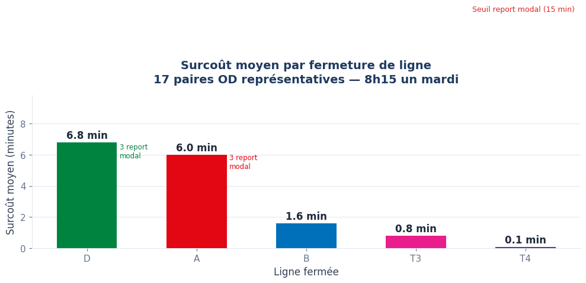
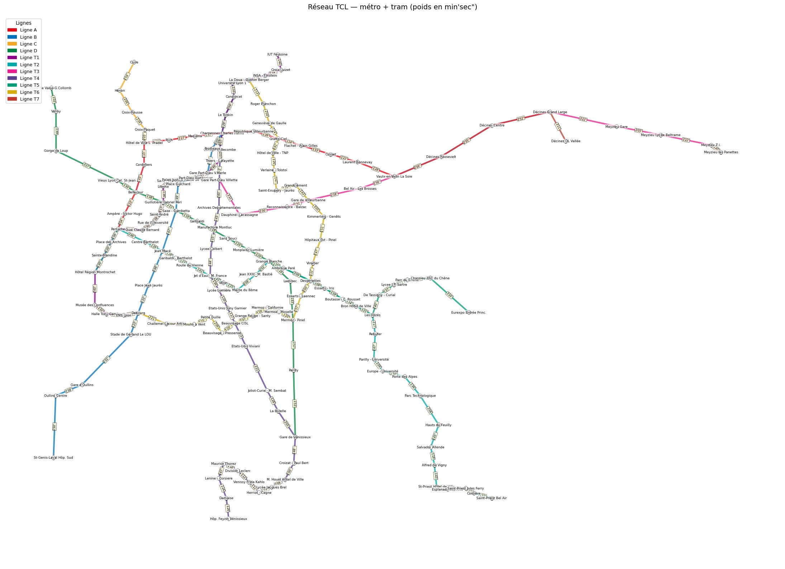
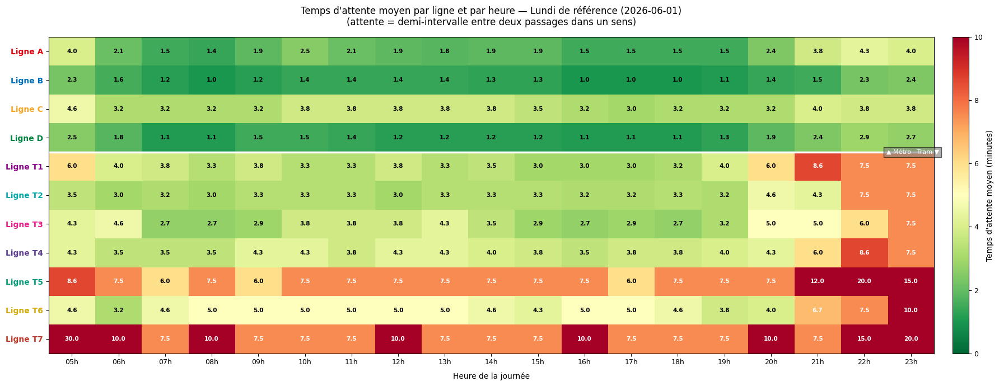

# Résilience du réseau de transport TCL (Lyon)

**Quel serait l'impact de la fermeture d'une ligne de métro ou de tram sur les trajets des Lyonnais ?**

Projet réalisé à Polytech Lyon (juin 2026) par **Malo Vaillant** et **Sally Rabine**, sous la direction de Mme Frédérique Bienvenue.



## En bref

- Modélisation du réseau métro + tram des TCL en **graphe pondéré** à partir des données publiques **GTFS**
- Calcul d'itinéraires optimaux par un **Dijkstra étendu aux états (station, ligne)**, qui tient compte des temps d'attente réels à chaque correspondance selon l'heure
- Simulation de la demande de déplacements par **chaîne de Markov**, pour obtenir des paires origine–destination représentatives
- Simulation de la fermeture de chaque ligne et mesure du **temps perdu par les usagers**

**Résultat principal :** les lignes **A et D** sont les plus critiques du réseau, avec 6 à 7 minutes de surcoût moyen par trajet et des usagers qui basculeraient probablement vers un autre mode de transport. La ligne B suit avec environ 2 minutes, grâce à une redondance partielle avec la ligne A.

## Données

Données **GTFS** (General Transit Feed Specification) du réseau urbain TCL, en accès libre sur le Point d'accès national aux données de transport : [GTFS – Réseau urbain TCL (transport.data.gouv.fr)](https://transport.data.gouv.fr/resources/81943).

| Fichier | Contenu |
|---|---|
| `stops.txt` | Arrêts et coordonnées GPS |
| `routes.txt` | Lignes (métro : `route_type` 1, tram : `route_type` 0) |
| `trips.txt` | Association trajet → ligne et service |
| `stop_times.txt` | Horaires de passage à chaque arrêt |
| `calendar.txt`, `calendar_dates.txt` | Jours de circulation et exceptions |

Réseau étudié : les 4 lignes de métro (A, B, C, D) et les 7 lignes de tram (T1 à T7). Journée de référence : lundi 1er juin 2026, celle qui compte le plus de services actifs.

Les fichiers GTFS ne sont pas inclus dans ce dépôt.

## Méthode

### 1. Graphe du réseau

Chaque nœud est une station (les arrêts portant le même nom sont fusionnés) et chaque arête un tronçon entre deux stations consécutives. Le poids d'une arête est le **temps médian** de parcours sur la journée, plus robuste que la moyenne aux trajets exceptionnels. Quand plusieurs lignes partagent un tronçon (T1 et T4, par exemple), l'arête garde la liste des lignes qui l'empruntent.



### 2. Temps d'attente par ligne et par heure

Pour chaque ligne et chaque tranche horaire (5 h – 23 h), on compte les départs et on estime l'attente moyenne comme la moitié de l'intervalle entre deux passages.



### 3. Dijkstra étendu aux états (station, ligne)

Un Dijkstra classique ignore les correspondances. On travaille donc sur des états *(station, ligne courante)*, avec trois types de coût :

- **rester sur la même ligne** : temps de parcours du tronçon ;
- **changer de ligne** : 90 s de marche entre quais + attente moyenne de la nouvelle ligne ;
- **premier embarquement** : attente moyenne de la ligne.

L'attente est évaluée à l'**heure réelle d'arrivée** à chaque correspondance (heure de départ + temps déjà écoulé), et non à l'heure de départ. Pour l'origine et la destination, les 3 stations les plus proches sont testées (distance à vol d'oiseau × 1,3 pour tenir compte des détours), et on garde le trajet total le plus court.

### 4. Simulation de la demande par chaîne de Markov

Chaque arrêt est un état. Les probabilités de transition dépendent de l'affluence estimée (passages × taux de remplissage selon l'heure), et la probabilité de sortie combine l'importance de la station comme correspondance et la fréquentation annuelle des lignes :

`p_sortie = 0,6 × f_correspondance + 0,4 × f_fréquentation`

1 000 trajets simulés (avec interdiction des retours en arrière) fournissent les paires origine–destination les plus fréquentes.

### 5. Impact d'une fermeture

Pour chaque ligne, on retire la ligne du graphe (les tronçons partagés restent accessibles aux autres lignes), puis on recalcule chaque trajet. L'écart de temps classe chaque usager :

| Catégorie | Surcoût | Interprétation |
|---|---|---|
| Non impacté | ≤ 30 s | Pas de changement |
| Impacté | 30 s – 15 min | Reste en transports en commun, trajet plus long |
| Report modal | > 15 min | Bascule probable vers la voiture ou un autre mode |

## Résultats

Calculs sur **17 paires origine–destination** représentatives, à 8 h 15 un mardi (heure de pointe).

- **Ligne A** : l'axe est–ouest du réseau. Sans elle, Vaulx-en-Velin La Soie → Hôtel de Ville perd plus de 40 minutes.
- **Ligne D** : seule desserte directe de l'ouest vers le centre (Gorge de Loup → Bellecour, + 40 min) ; les accès au pôle hospitalier de Grange Blanche sont aussi fortement dégradés.
- **Ligne B** : impact modéré, concentré sur les liaisons nord–sud et l'accès à la Part-Dieu.
- **Tram T3** : impact limité mais ciblé sur la liaison Décines → Part-Dieu.
- Les autres lignes n'ont pas d'impact sur ce panel, centré sur les grands axes de métro ; cela ne signifie pas qu'elles sont inutiles.

Le rapport complet est dans [`rapport_projet_TCL.pdf`](rapport_projet_TCL.pdf).

## Limites

- Les données GTFS décrivent l'**offre** de transport, pas les déplacements réels : la demande est simulée, et la fréquentation n'est connue que par ligne, pas par station.
- La chaîne de Markov suppose qu'un voyageur choisit sa prochaine station sans tenir compte de sa destination finale.
- Plusieurs paramètres (taux de remplissage, probabilité de sortie, seuil de 15 minutes) reposent sur des hypothèses simplificatrices.
- Analyse limitée à une heure de pointe et à 17 paires origine–destination.

**Pistes d'amélioration :** données réelles de montées–descentes, plusieurs tranches horaires, temps de marche réels (API OSRM), intégration des bus, vélos et funiculaires.

## Exécution

```bash
pip install pandas numpy networkx matplotlib
```

1. Télécharger les [données GTFS des TCL](https://transport.data.gouv.fr/resources/81943), décompresser l'archive et placer les fichiers `.txt` dans le même dossier que le notebook.
2. Adapter les chemins de chargement des fichiers (le notebook a été écrit pour Google Colab, avec des chemins en `/content/`).
3. Ouvrir `metro_tcl.ipynb` : la cellule **Paramètres** permet de changer la date, l'heure et les coordonnées de départ et d'arrivée.

## Outils

Python · pandas · NumPy · NetworkX · Matplotlib · données GTFS
